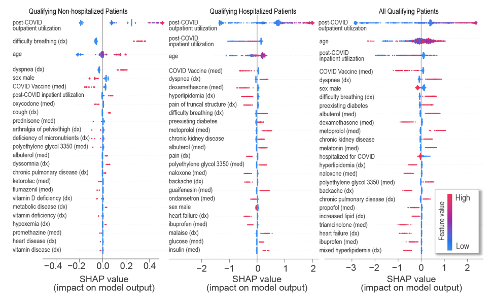

## Who has long-COVID? A big data approach 

## Introduction

This is reproducible code for our paper, [Who has long-COVID? A big data approach](https://doi.org/10.1101/2021.10.18.21265168), which uses data from the National COVID Cohort Collaborative’s (N3C) EHR repository to identify potential long-COVID patients. The full citation is:

    Pfaff ER, et al. Who has long-COVID? A big data approach. medRxiv 2021; : 2021.10.18.21265168.

## Abstract
**Background**
Post-acute sequelae of SARS-CoV-2 infection (PASC), otherwise known as long-COVID, have severely impacted recovery from the pandemic for patients and society alike. This new disease is characterized by evolving, heterogeneous symptoms making it challenging to derive an unambiguous long-COVID definition. Electronic health record (EHR) studies are a critical element of the NIH Researching COVID to Enhance Recovery (RECOVER) Initiative, which is addressing the urgent need to understand PASC, accurately identify who has PASC, and identify treatments. 

**Methods**
Using the National COVID Cohort Collaborative’s (N3C) EHR repository, we developed XGBoost machine learning (ML) models to identify potential long-COVID patients. We examined demographics, healthcare utilization, diagnoses, and medications for 97,995 adult COVID-19 patients. We used these features and 597 long-COVID clinic patients to train three ML models to identify potential long-COVID patients among (1) all COVID-19 patients, (2) patients hospitalized with COVID-19, and (3) patients who had COVID-19 but were not hospitalized.

**Findings**
Our models identified potential long-COVID patients with high accuracy, achieving areas under the receiver operator characteristic curve of 0.91 (all patients), 0.90 (hospitalized); and 0.85 (non-hospitalized). Important features include rate of healthcare utilization, patient age, dyspnea, and other diagnosis and medication information available within the EHR. Applying the "all patients” model to the larger N3C cohort identified 100,263 potential long-COVID patients.

**Interpretation**
Patients flagged by our models can be interpreted as “patients warranting likely to be referred to or seek care at a long-COVID specialty clinic,” an essential proxy for long-COVID diagnosis while consensus is reached on a definitionin the current absence of a definition. We also achieve the urgent goal of identifying potential long-COVID patients for clinical trials. As more data sources are identified, the models can be retrained and tuned based on study needs.

**Funding**
This study was funded by NCATS and NIH through the RECOVER Initiative.

## Issues 
Please report issues via email or via the [issues page](https://github.com/abhatia08/n3c-longcovid-paper1/issues)

## Data Sharing Statement

The N3C data transfer to NCATS is performed under a Johns Hopkins University Reliance Protocol # IRB00249128 or individual site agreements with NIH. The N3C Data Enclave is managed under the authority of the NIH; information can be found at ncats.nih.gov/n3c/resources. Enclave data is protected, and can be accessed for COVID-related research with an approved (1) IRB protocol and (2) Data Use Request (DUR). A detailed accounting of data protections and access tiers is found in [1]. Enclave and data access instructions can be found at https://covid.cd2h.org/for-researchers.

## Project Structure

  - `./scripts/` contains all the scripts used in the analysis. 
  - `./figures/` contains the figures developed for publication, using the results generated by the `./scripts/` pipeline

## Authors
- [Emily R. Pfaff](https://www.med.unc.edu/medicine/directory/emily-pfaff/) (:[empff](https://github.com/empfff))
- [Andrew T. Girvin](https://scholar.google.com/citations?hl=en&user=y77jJvUAAAAJ&view_op=list_works&sortby=pubdate)(:[andrewtgirvin](https://github.com/andrewtgirvin))
- [Tellen D. Bennett](https://profiles.ucdenver.edu/display/7031630)
- [Abhishek Bhatia](https://abhatia.me/) (: [abhatia08](https://github.com/abhatia08) | :[@abhibhatia08](https://twitter.com/abhibhatia08))
- [Ian M. Brooks](https://www.linkedin.com/in/imbrooks/)
- [Rachel R Deer](https://www.utmb.edu/rehabsciences/biographies/rachel-deer-phd)
- [Jonathan P Dekermanjian](https://coloradosph.cuanschutz.edu/resources/directory/directory-profile/Dekermanjian-Jonathan-UCD172594) (: [dekermanjian](https://github.com/Dekermanjian))
- [Sarah Elizabeth Jolley](https://www.cumedicine.us/providers/medicine/sarah-jolley)(:[@se_jolley](https://twitter.com/se_jolley))
- [Michael G. Kahn](https://profiles.ucdenver.edu/display/225446)
- [Kristin Kostka](https://www.ohdsi.org/who-we-are/collaborators/kristin-kostka/)(: [kmkostka](https://github.com/kmkostka ) | :[@kricketchirps](https://twitter.com/kricketchirps))
- [Julie A McMurry](https://tislab.org/members/julie-mcmurry.html) (: [jmcmurry](https://github.com/jmcmurry ) | :[@figgyjam](https://twitter.com/figgyjam))
- [Richard Moffitt](https://bmi.stonybrookmedicine.edu/people/moffitt_richard)
- [Anita Walden](https://cd2h.org/node/146) (:[@awalden20](https://twitter.com/awalden20))
- [Christopher G Chute](https://www.hopkinsmedicine.org/profiles/details/christopher-chute)
- [Melissa A Haendel](https://medschool.cuanschutz.edu/biochemistry/people/primary-faculty/haendel-melissa) (: [tis-lab](https://github.com/tis-lab) | :[@ontowonka](https://twitter.com/ontowonka))

## Notes
This repository is continually updated for clarity in response to feedback. However, all code will remain public.

For full transparency, we include what the respository looked like at the time of journal submission. Thus, the First release is the version of the repository that existed at the time of submission. This release is archived on Zenodo:

An early pre-print of this paper is available on medRxiv: _[Who has long-COVID? A big data approach](https://doi.org/10.1101/2021.10.18.21265168)_
